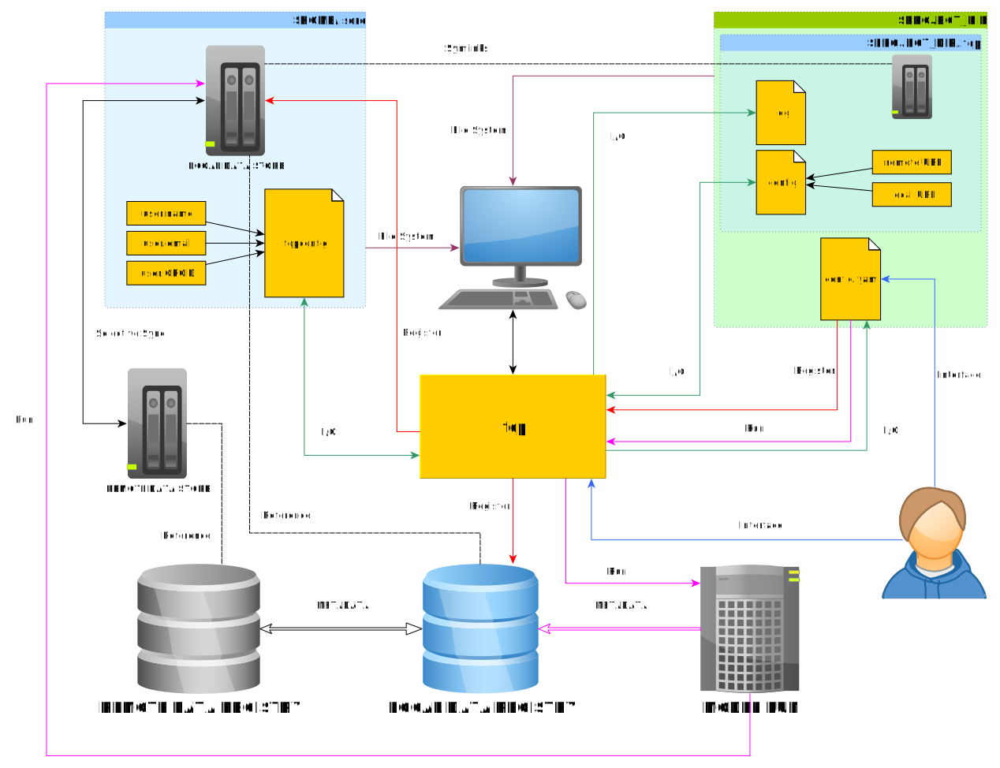

# Proposal for an SCRC FAIR Data Pipeline Synchronisation Client Command Line Interface
In the following document I outline a proposal for the synchronisation system `fair` which aims to synchronise a local version of the SCRC FAIR Data pipeline registry. Much of this plan proposes using commands which mirror those contained within the `git` interface. My argument for this is it is an interface familiar to many already and so easy to learn.

## Local cache
I use the term "local cache" to refer to the mirror of the `.git` folder created when initialising a repository. My current understanding is that there is to be a folder `$HOME/.scrc` however this creates the following issues:

- Paths have a constant address that does not vary depending on where you are on the file system. This makes it easy to keep note of which files are being tracked. By having a `.git` folder in each repository Git is able to easily produce reports for commands like `git status` which make sense as it can calculate where the user is in relation to `.git`, e.g.:

```
$ ls -a
.   .git fair
$ git add fair/test_file
$ git status
On branch master
Changes to be committed:
  (use "git restore --staged <file>..." to unstage)
        new file:   fair/test_file
$ cd fair
$ git status
On branch master
Changes to be committed:
  (use "git restore --staged <file>..." to unstage)
        new file:   test_file
```
this would not be possible if the location was `$HOME/.git`.

- The user might want to keep tracking cases separate, e.g. they may have two models and only want to handle one at a time. In this case having a `.fair` folder in each repository with a candidate `config.yaml` would make sense.
- I would strongly oppose creating hidden folders in the user's home area. Unless you have a clear uninstallation procedure that is not OS specific that removes this folder then you risk leaving orphaned directories. Whereas if the folder is created for a project then this is no longer an issue.

## Initialisation
To ensure that the `config.yaml` location is always alongside a `.fair` folder, encourage users to use a command like:
```
$ fair init
```
which would make both. Police this by raising an exception if the `config.yaml` is not partnered with a `.fair` directory. Maybe even make a copy of `config.yaml` that is "packed" into `.fair` in case the two become separated, which would fall under:
```
$ fair reset config.yaml
```
use `config.yaml` to explicitly state you want to reset the config file, else by default this is ignored as it is not data.

## Repository wide addition
Ideally `data_store` should work like `.git` in that it is a hidden container, I am aware the APIs will want to read from this location, could they perhaps read this hidden folder? If the user works with the original file and commits it then the hidden version would be updated anyway (again mirroring git). Could also even have the option to archive data in `.fair` to save space, retrieving when needed (again like git).

Assuming a data_store is constructed always relative to a `config.yaml`, allow the user to ultimately add anything in the repository for tracking:

```
fair add ./my_data/a_data_file.txt
```
this would copy the version into `.fair/data_store/` and add it to tracking.

## Configuration
Configure the user in a manner again alike to `git`:
```
$ fair config user.name "Kristian Zarebski"
$ fair config user.email "kristian.zarebski@ukaea.uk"
$ fair config user.orcid "0000-0002-6773-1049"
```

## Status
No need to reinvent the wheel here, red for untracked and unstaged, green for staged.

## Reset
Remove any staging set before `push`:
```
$ fair reset
```
use `--hard` to force versions to return to the last synced version:
```
$ fair reset --hard
```

## Removing files
Again, alike to git have `fair rm` and `fair rm --cached`, to remove from tracking and the file system, or just tracking.

